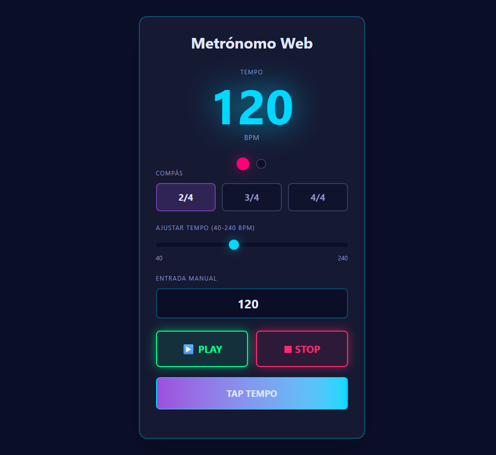

# 🎵 Metronome Lite

A modern, web-based metronome built with React, TypeScript, and Web Audio API. Features precise timing, customizable time signatures, and a retro synthwave aesthetic.

## 🚀 Live Demo

[View Live App](https://metronome-lite.netlify.app)

## 📸 Preview

)

## ✨ Features

- **Precise Timing**: Custom scheduler using Web Audio API for drift-free playback
- **Time Signatures**: Support for 2/4, 3/4, 4/4 with dynamic beat indicators
- **Tap Tempo**: Calculate BPM by tapping rhythm
- **Real-time Controls**: Adjust tempo on-the-fly while playing
- **Retro Synthwave UI**: Dark mode with neon accents and glow effects

## 🛠️ Tech Stack

- **React** - Component-based UI
- **TypeScript** - Type safety
- **Tailwind CSS v4** - Styling with custom CSS variables
- **Web Audio API** - High-precision audio synthesis
- **Vite** - Fast build tool

## 🏗️ Architecture

- **Custom Hook** (`useMetronome`) - Encapsulates timing logic
- **Modular Components** - Separated UI concerns
- **Scheduler Pattern** - Prevents timing drift with lookahead scheduling
- **State Management** - Lifting state up pattern

## 🚀 Getting Started

```bash
# Install dependencies
npm install

# Run development server
npm run dev

# Build for production
npm run build
```

## 📝 What I Learned

- Implementing precise timing with Web Audio API scheduler
- Building reusable React components with TypeScript
- Creating custom hooks for complex stateful logic
- Managing ref-based state for performance optimization
- Tailwind v4 theming with CSS variables

## 👨‍💻 Author

Pedro Vercesi

---

**Note:** This is an educational project built for portfolio purposes.
